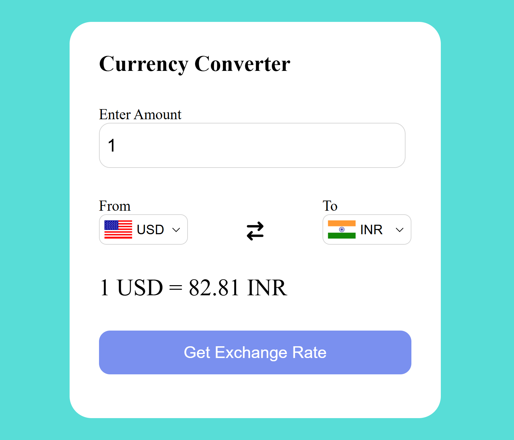

# 💱 Currency Converter

A responsive and interactive Currency Converter web app that fetches live exchange rates using a public API. Users can select any two currencies, enter an amount, and instantly see the converted result. The app also includes flag icons for an intuitive UI experience.



---

## 🚀 Features

- 🌍 Convert between over 100 currencies
- 📈 Live exchange rates from a free API
- 🇺🇸 Country flags auto-update on currency change
- 🔁 Easy currency swap button
- 🖥️ Fully responsive design

---

## 📦 Tech Stack

- HTML5
- CSS3
- JavaScript
- [Currency API](https://2024-03-06.currency-api.pages.dev/)
- [FlagsAPI](https://flagsapi.com/)
- Font Awesome Icons

---

## 📸 Demo

You can host it using GitHub Pages or Netlify and add the link here:

[Live Demo](https://HasibulAnsari.github.io/currency-converter/)

---

## 🛠️ Setup Instructions

1. Clone the repository:

```bash
git clone https://github.com/HasibulAnsari/currency-converter.git
cd currency-converter
